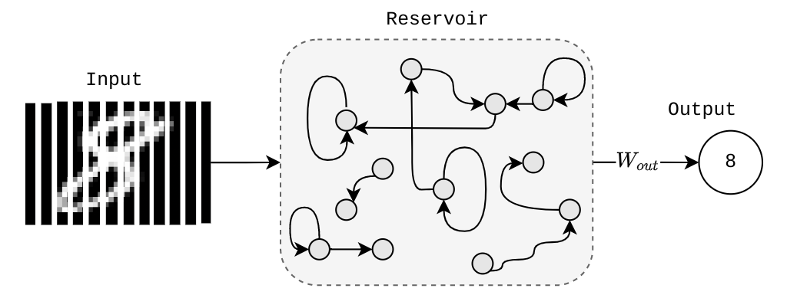

# online-esn
Online learning algorithms applied to Echo State Networks.

Echo state networks (ESN) provide an architecture and supervised learning principle for recurrent neural networks (RNNs). This repository implements a ESN along with a variety of different online learning algorithms.

The main idea is:

1. Drive a random, large, fixed recurrent neural network with the input signal, thereby inducing in each neuron within this "reservoir" network a nonlinear response signal
    
2. Combine a desired output signal by a trainable linear combination of all of these response signals.

# System
The below figure outlines an example of classifying columnwise Mnist digits using a single linear output layer. This implementation can achieve upwards of 95% on columnwise Mnist when the ESN is combined with a two layer MLP.

# Formatting
This repository uses `black`, `mypy` and `isort` for formatting the codebase.